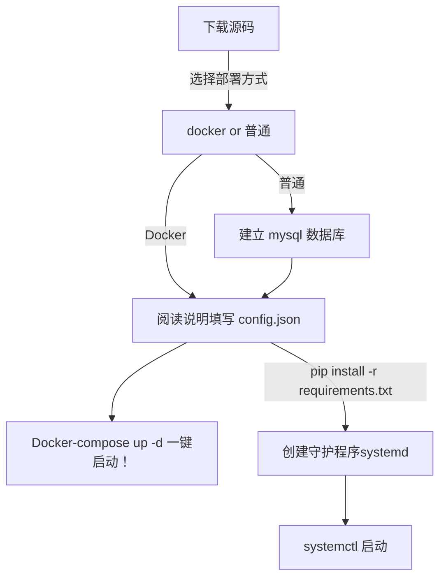

# 如何部署

[← 返回首页](../index.md)

---

## 流程图



!!! info "说明"

    墙裂推荐 Debian 11 操作系统，AMD 处理器架构 部署 Docker 方式启动

    docker 易于维护，方便部署

---

## Docker 部署

### 1. 下载源码

```bash
git clone https://github.com/berry8838/Sakura_embyboss.git
cd Sakura_embyboss
```

### 2. 配置 config.json

```bash
cp config_example.json config.json
nano config.json
```

### 3. 启动

```bash
docker-compose up -d
```

---

## 源码部署

### 1. 建立 MySQL 数据库

```bash
mysql -u root -p
CREATE DATABASE embyboss CHARACTER SET utf8mb4 COLLATE utf8mb4_unicode_ci;
```

### 2. 安装依赖

```bash
pip install -r requirements.txt
```

### 3. 配置 config.json

```bash
cp config_example.json config.json
nano config.json
```

### 4. 创建 systemd 守护程序

```bash
cp embyboss.service /etc/systemd/system/
systemctl daemon-reload
systemctl enable embyboss
systemctl start embyboss
```

---

*最后更新: 2026-04-26*
